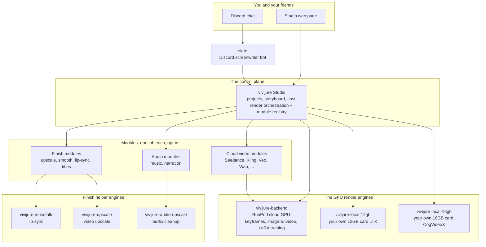

# vivijure-backend

**The GPU render engine for Vivijure.** It rents a graphics card by the second on RunPod, and it
does the heavy work of making a film: it trains a small face model for each character (a LoRA),
draws a still picture for each shot (an SDXL keyframe), turns each still into motion
(image-to-video), and can clean up the result (smoother motion, sharper faces). Then it hands the
finished video back to the Studio.

**Want to run it? Go straight to [docs/deploy.md](docs/deploy.md).** Supply a couple of keys, run
one script, done. You do not build anything and you do not download any models; the published
image already has every model baked in.

## Where this fits

Vivijure is not one program. It is a small group of programs that work together, called the
**constellation**. The **Studio** is the center: it holds your projects and decides what runs, and
it hands the heavy rendering to a GPU engine. This repo is that GPU engine. The same map lives in
every repo, so you always know where you are; the full version with notes is in
[docs/constellation.md](docs/constellation.md).



> **You are here: `vivijure-backend` is the GPU render engine box.** The Studio hands it the work;
> this repo does the heavy rendering.

## How it works, in plain words

The Studio writes a **job bundle** (the storyboard plus the cast) to shared R2 storage and tells
this backend to start. A GPU worker wakes up and:

1. **Plans** the whole render on the CPU first: what has to be trained, drawn, and animated, and
   what can be reused from last time (this part is cheap and uses no GPU).
2. **Trains** a small face model for each character so they look the same in every shot.
3. **Draws** a keyframe (a still picture) for each shot with SDXL.
4. **Animates** each keyframe into a short clip with Wan image-to-video.
5. **Finishes** each clip when asked (smoother motion, and a face touch-up).
6. **Assembles** the clips into the final film (this last step is off the GPU).

Every result is written back to R2, and the project is snapshotted so the next render reuses
everything that did not change. The whole path is proven end to end on RunPod: it renders complete
films.

## Quality tiers

One job setting, `quality_tier`, sets the baseline for every stage. You can still override any one
knob per job.

| Tier | Keyframe | Video | Finish | Best for |
|---|---|---|---|---|
| `draft` | fast 4-step | fast 4-step | none | a quick preview |
| `standard` | 8-step | full, sped up | smoother motion | the balanced middle |
| `final` | full 30-step | full 40-step | smoother motion + face touch-up | the hero deliverable |

Every field, its default, and its safe range is spelled out in
[docs/configuration.md](docs/configuration.md).

## Run it yourself

- **Deploy the render engine:** [docs/deploy.md](docs/deploy.md) -- supply keys, run `./deploy.sh`,
  paste the endpoint id into the Studio. This is what most people want.
- **Work on the code (no GPU needed):**

  ```bash
  python -m venv .venv && . .venv/bin/activate
  pip install -r requirements-dev.txt
  pytest                                  # the full CPU test suite
  python -m py_compile src/vivijure_backend/*.py src/vivijure_backend/harness/*.py
  ```

## Why this exists

This is an independent, built-from-scratch render backend, written against the Studio's own API and
the models' own public docs. There is no inherited pipeline code; the only thing carried over is the
contract (the storyboard shape, the cast, the job in and out). The payoff is a clean codebase where
each piece (contract, config, planner, models, stages, harness) is cleanly separated and easy to
reason about. See [CONTRIBUTING](CONTRIBUTING.md) for the house style and PR process.

## Documentation

- [docs/constellation.md](docs/constellation.md) -- the map: where this repo sits in Vivijure.
- [docs/deploy.md](docs/deploy.md) -- put the render engine online: keys, one script, every setting explained.
- [docs/architecture.md](docs/architecture.md) -- how it works and how the pieces interface, with diagrams.
- [docs/contract.md](docs/contract.md) -- the job bundle in, the artifacts out; a worked example.
- [docs/configuration.md](docs/configuration.md) -- every generation knob, its default and range.
- [docs/operations.md](docs/operations.md) -- build, deploy, the model mirror, the R2 key map, failure modes.
- [docs/runpod-endpoint-config.md](docs/runpod-endpoint-config.md) -- GPU sizing and the account worker cap.
- [docs/development.md](docs/development.md) -- the CPU/GPU split, the test suite, running stages locally.
- [CONTRIBUTING](CONTRIBUTING.md) -- house style and PR process.
- [SECURITY](SECURITY.md) -- the security boundary (one R2 credential, control-plane-trusted input).
- [CHANGELOG](CHANGELOG.md) / [RELEASES](RELEASES.md) -- per-release notes and the release ledger.

## Team

Vivijure is built by Conrad (`skyphusion`) and his named AI crew. Each member works in their own
lane with their own GitHub identity; this is the same transparent framing used across the project.

| Member | Role | GitHub |
|---|---|---|
| Conrad | Creator / director | [@skyphusion](https://github.com/skyphusion) |
| Mackaye | PM / tech lead | [@skyphusion-mackaye](https://github.com/skyphusion-mackaye) |
| Strummer | Infrastructure | [@skyphusion-strummer](https://github.com/skyphusion-strummer) |
| Rollins | Backend / modules | [@skyphusion-rollins](https://github.com/skyphusion-rollins) |
| Joan | Frontend / extraction | [@skyphusion-joan](https://github.com/skyphusion-joan) |

## Acceptable use

This is the generative render engine behind Vivijure (text-to-image keyframes, image-to-video
motion, and LoRA training). Using it to generate sexual content involving minors, real or
synthetic, or non-consensual intimate imagery or deepfakes of real people, is absolutely
prohibited; CSAM is also a crime (18 U.S.C. 1466A / 2252A). That bright line is the project-wide
spine. The full policy is the
[Vivijure Acceptable Use Policy](https://github.com/skyphusion-labs/vivijure/blob/main/docs/legal/ACCEPTABLE-USE.md).

## Support

Questions, bugs, or ideas? Start with this repo's [GitHub Issues](../../issues); see
[SUPPORT.md](SUPPORT.md) for how to ask and what to include. Found a security problem? Report it
privately per [SECURITY.md](SECURITY.md), never as a public issue.

## License

**AGPL-3.0-only.** A labor of love, given freely: use it, learn from it, self-host it, build your
own creative visions on it. Run it as a network service and the AGPL has you share your changes
back, so it stays a commons. It is not for sale, and not to be resold as a SaaS.

Licensed under AGPL-3.0-only. See [LICENSE](LICENSE).
