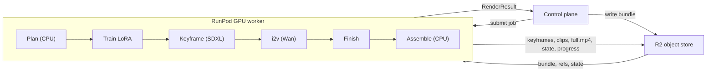

# vivijure-backend

A render backend for Vivijure: it consumes a project bundle (a standard
`storyboard.yaml` plus the cast), generates SDXL keyframes, trains per-character LoRAs,
turns the keyframes into motion with image-to-video, and returns the artifacts in the
shape the Vivijure control plane already expects.


## Ecosystem

```
slate  -->  vivijure  -->  vivijure-backend
```

| Repo | Role |
|---|---|
| [slate](https://github.com/skyphusion-labs/slate) | Collaborative AI screenwriter Discord bot -- shapes the film in-channel, then hands it to vivijure to render |
| [vivijure](https://github.com/skyphusion-labs/vivijure) | AI film studio control plane (Cloudflare Worker) -- planner, cast, render UI; orchestrates render jobs |
| **[vivijure-backend](https://github.com/skyphusion-labs/vivijure-backend)** | **GPU render backend (RunPod serverless) -- SDXL keyframes, i2v, finish, assemble** |

## What it is

The control plane writes a project bundle to object storage (R2) and submits a render job. A
RunPod serverless GPU worker pulls the bundle, **plans** the whole render on the CPU (what must
train, draw, animate, and what can be reused), then **executes** only that plan on the GPU:
train a small identity LoRA per character, draw an SDXL keyframe per shot, animate each keyframe
into a clip with Wan 2.2 image-to-video, optionally finish each clip (frame interpolation + face
restore), and concatenate the clips off-GPU into the final film. Every artifact is written back
to R2 under a project-keyed layout the control plane polls for, and the project tree is
snapshotted so the next render reuses everything that did not change.

The LLM-free render path is proven end-to-end on RunPod serverless: it renders complete films.
GPU-validated features land tagged; the CPU-testable logic is covered by the suite in `tests/`.

## Why this exists

This is an independent, built-from-scratch implementation, written against the control-plane
API contract and the underlying models' own documentation. There is no inherited pipeline code
and no legacy cruft; the contract (the `storyboard.yaml` schema, the cast registry, the
render-job input/output) is the only thing carried over, and that contract is the control
plane's own. The payoff is a clean-sheet codebase that is easy to extend and to reason about:
contract, config, orchestrator, routing, models, stages, and harness are each cleanly
separated. See [CONTRIBUTING](CONTRIBUTING.md) for the house style and PR process.

## Architecture at a glance



| Module | Role |
|---|---|
| `contract.py` | storyboard + cast + job I/O types; the bundle reader |
| `config.py` | typed `RenderConfig`: every generation knob, clamped and tier-aware |
| `orchestrator.py` | the CPU planner: what to train / draw / animate / reuse |
| `routing.py` / `device.py` | stage-to-GPU-tier policy; card-to-precision fingerprinting |
| `models.py` | capability-aware model loading (the warm `ModelServer`) |
| `lora_train.py` / `keyframe.py` / `i2v.py` / `finish.py` | the GPU render stages |
| `assemble.py` | off-GPU ffmpeg concat into the final film |
| `pipeline.py` | `GpuPipeline.execute`: runs the plan over the stages |
| `harness/` | the serverless spine: RunPod handler, R2 I/O, key layout, progress, model mirror |

Full detail, with diagrams of the render-job sequence, the planner decision tree, and the
capability-aware precision model, is in [docs/architecture.md](docs/architecture.md).

## Quality tiers

One job parameter, `quality_tier`, sets every stage baseline (overridable per knob via
`render_overrides`):

| Tier | Keyframe | Image-to-video | Finish | i2v GPU tier |
|---|---|---|---|---|
| `draft` | Hyper-SD 4-step | Lightning 4-step distill | none (preview) | RTX PRO 6000 |
| `standard` | Hyper-SD 8-step | full 20-step + EasyCache | interpolate 2x | H200 |
| `final` | full 30-step | full 40-step + MixCache | interpolate 2x + face restore | B200 |

See [docs/configuration.md](docs/configuration.md) for every field, default, and range.

## Quickstart

```bash
# CPU dev: no GPU, no model weights needed
python -m venv .venv && . .venv/bin/activate
pip install -r requirements-dev.txt
pytest                                  # the full CPU suite

# quick syntax check
python -m py_compile src/vivijure_backend/*.py src/vivijure_backend/harness/*.py
```

Run a single render stage by hand against a bundle (needs a CUDA pod + the `deploy/` stack):

```bash
python scripts/run_lora_train.py BUNDLE.tar.gz OUT_DIR --slot A
python scripts/run_keyframe.py   BUNDLE OUT_DIR --shot shot_02 --lora A=/path/A.safetensors
python scripts/run_i2v.py        BUNDLE OUT_DIR --shot shot_01 --keyframe /path/shot_01.png
```

Build and deploy the worker image: [docs/operations.md](docs/operations.md) (and
[deploy/README.md](deploy/README.md) for the build mechanics).

## Documentation

- [docs/architecture.md](docs/architecture.md) -- how it works and how the pieces interface, with diagrams.
- [docs/contract.md](docs/contract.md) -- the bundle, the render job, the result; worked example.
- [docs/configuration.md](docs/configuration.md) -- `RenderConfig`: every knob, default, range, and quality-tier baseline.
- [docs/operations.md](docs/operations.md) -- build, deploy, the model mirror, the R2 key map, the progress channel, failure modes.
- [docs/development.md](docs/development.md) -- the CPU/GPU split, the test suite, running stages locally.
- [docs/cold-start-design.md](docs/cold-start-design.md) -- issue #55 Phase B: the cold-start cost model (from telemetry) and the bake/pre-warm/stage decision.
- [CONTRIBUTING](CONTRIBUTING.md) -- house style, PR process.
- [SECURITY](SECURITY.md) -- the security boundary (one R2 credential, control-plane-trusted input).
- [CHANGELOG](CHANGELOG.md) / [RELEASES](RELEASES.md) -- per-release notes and the release ledger.

## License

**AGPL-3.0-only.** A labor of love, given freely: use it, learn from it, self-host it, build your own creative visions on it. Run it as a network service and the AGPL has you share your changes back, so it stays a commons. It is not for sale, and not to be resold as a SaaS.
