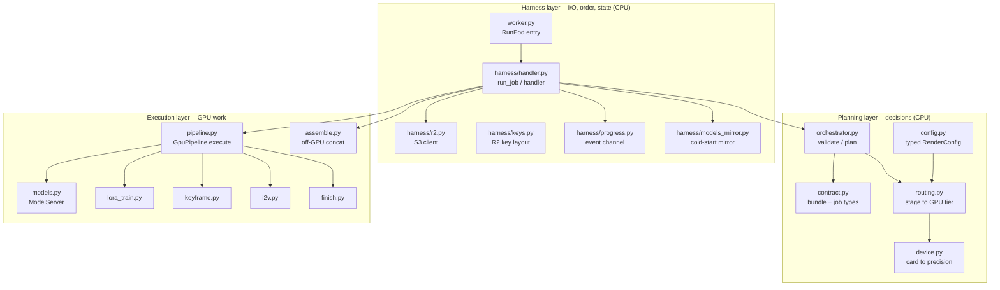
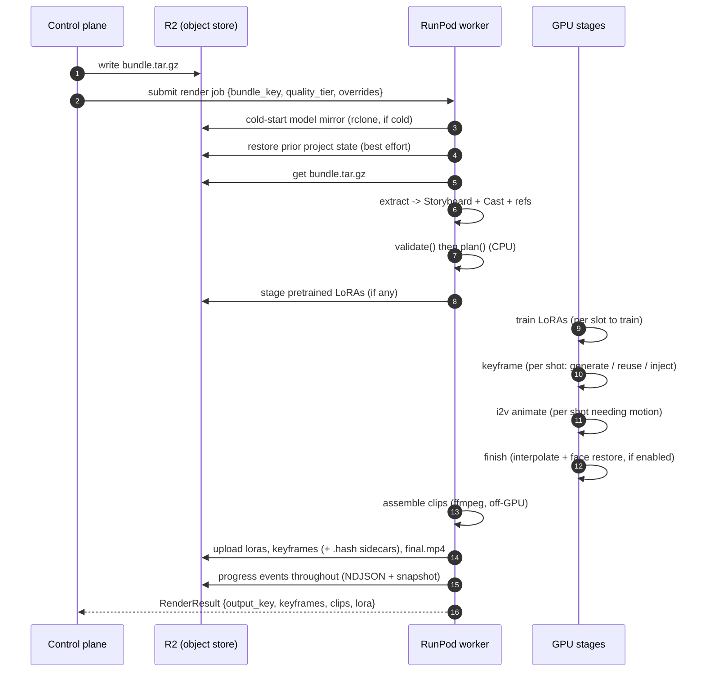
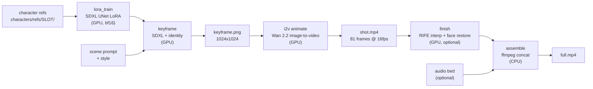
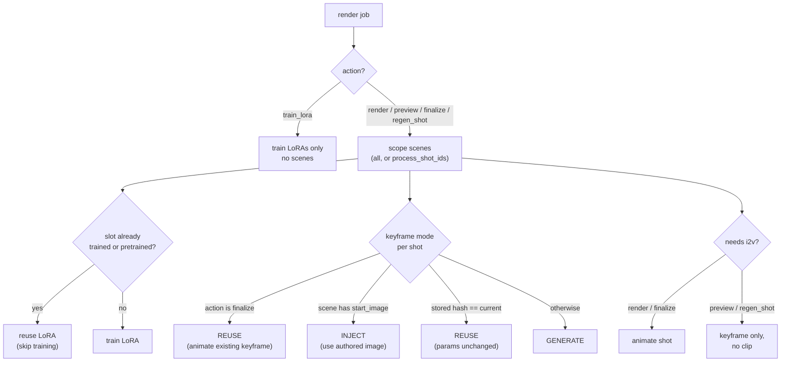
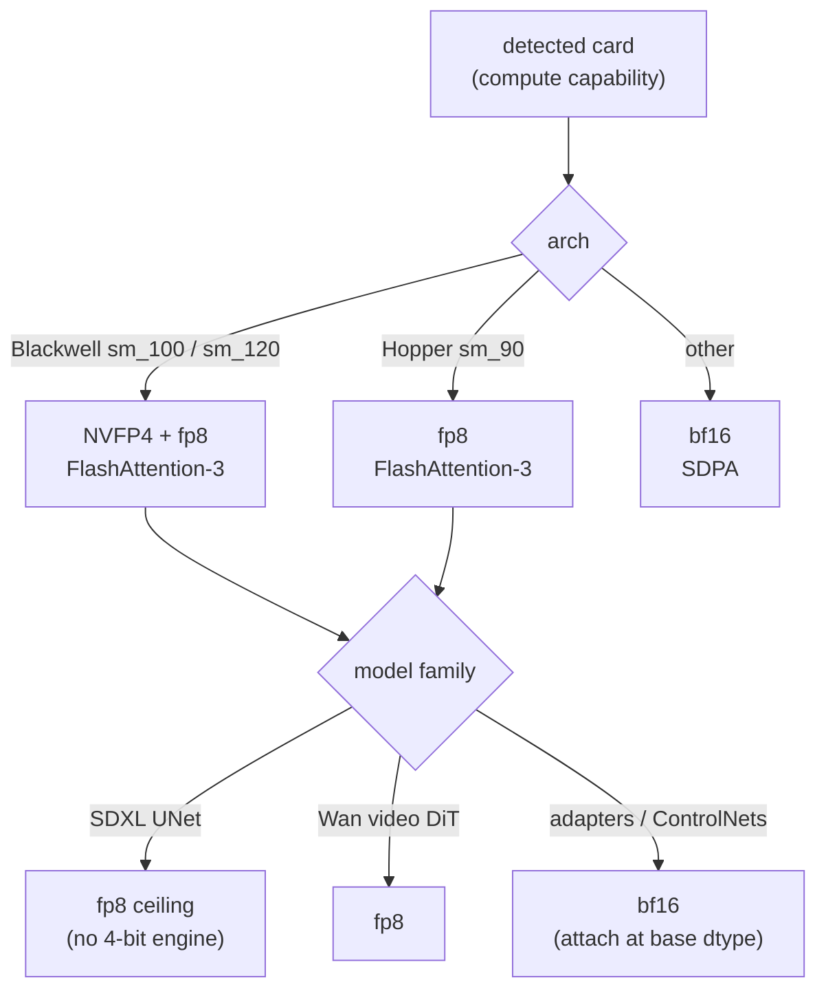

# Architecture

How the backend works and how the pieces interface. This is the deep dive; the
[README](../README.md) is the front door, [contract.md](contract.md) is the API the control
plane meets, [configuration.md](configuration.md) is every generation knob, and
[operations.md](operations.md) is how it deploys and runs.

## The one-paragraph version

The control plane writes a project bundle to R2 and submits a render job. A RunPod
serverless worker pulls the bundle, **plans** the whole render on the CPU (deciding what
must train, what must draw, what must animate, and what can be reused), then **executes**
only that plan on the GPU: train a small identity LoRA per character, draw an SDXL keyframe
per shot, animate each keyframe into a clip with Wan image-to-video, optionally finish each
clip (frame interpolation + face restore), and concatenate the clips off-GPU into the final
film. Every artifact is written back to R2 under a project-keyed layout the control plane
polls for, and the project's working tree is snapshotted so the next render of the same
project reuses everything that did not change.

## Three layers

The codebase separates cleanly into three responsibilities. Keeping them apart is what makes
the GPU-free logic testable on a CPU box and the expensive GPU work minimal.

**Planning layer (CPU, no GPU touched).** `contract.py` types the bundle and the render
job. `config.py` turns the request's quality tier plus `render_overrides` into a typed
`RenderConfig` where every field maps to a real model parameter. `orchestrator.py` takes the
request, the storyboard, and any prior state and produces a `RenderPlan`: which LoRAs to
train (vs reuse), which keyframes to generate (vs reuse or inject), which shots to animate,
and a GPU-seconds estimate. `routing.py` says which GPU tier a stage *should* run on;
`device.py` fingerprints the card the worker *actually* got and picks the precision it can
accelerate. The expensive resource is GPU-seconds, so every decision that can be made on the
cheap CPU is made here first.

**Execution layer (GPU).** `pipeline.py`'s `GpuPipeline.execute()` walks the plan and calls
the per-stage engines over a single warm `ModelServer` (`models.py`), which loads each model
once and caches it for the process lifetime. The engines are `lora_train.py`, `keyframe.py`,
`i2v.py`, and `finish.py`. `assemble.py` is the one CPU stage in this layer: it concatenates
the per-shot clips with ffmpeg and never schedules to a GPU.

**Harness layer (CPU, I/O and orchestration).** `harness/handler.py` owns the job lifecycle:
fetch the bundle, restore prior state, validate, plan, stage pretrained LoRAs, run the GPU
pipeline, finish, and upload. `harness/r2.py` is the S3-compatible R2 client; `harness/keys.py`
is the single source of the object-key layout; `harness/progress.py` is the structured event
channel; `harness/models_mirror.py` mirrors model weights from R2 on cold start. `worker.py`
is the RunPod entrypoint that wires a `GpuPipeline` onto the harness and starts the serverless
loop.

## The render job, end to end

The entrypoint is `harness/handler.py:run_job()`. It is the only client of the planner and
the pipeline; everything above (RunPod, R2, progress) is the harness's concern, and
everything below (the GPU engines) is the pipeline's. The clean seam between them is what lets
the whole control path be exercised on a CPU box with a fake pipeline and a fake object store
(see [development.md](development.md)).

## The render pipeline (per shot)

Once the plan is set, `GpuPipeline.execute()` runs the stages. LoRAs train first (once per
project, shared across shots), then each shot flows keyframe -> i2v -> finish, and finally the
clips assemble.

Stage by stage:

| Stage | Module | Engine | In -> Out | Device |
|---|---|---|---|---|
| LoRA train | `lora_train.py` | SDXL UNet DreamBooth-LoRA | refs -> `pytorch_lora_weights.safetensors` | GPU (bf16) |
| Keyframe | `keyframe.py` | SDXL + IP-Adapter / InstantID / regional pose | scene + LoRA + refs -> PNG | GPU |
| Image-to-video | `i2v.py` | Wan 2.2 I2V (A14B), optional Lightning distill | keyframe + prompt -> MP4 | GPU |
| Finish | `finish.py` | RIFE interpolation + GFPGAN / CodeFormer | MP4 -> MP4 | GPU (optional) |
| Assemble | `assemble.py` | ffmpeg concat-demuxer (+ audio mux) | clips -> final MP4 | CPU |

A few engine details worth knowing:

- **LoRA training** adapts the UNet attention projections only (`to_k`, `to_q`, `to_v`,
  `to_out.0`); the text encoders are left frozen to avoid drift. It runs in bf16 so the
  optimizer sees real gradients (fp8 is for inference). It is a DreamBooth-style fit on the
  5-20 reference images per slot, ~1000 steps at rank 16 by default.
- **Keyframe** is two-pass when `scene_lock` is on (the default on the canny-bearing image).
  Pass A draws a scene plate (style + scene prompt, no LoRA, no IP-Adapter; regional still
  plants OpenPose bodies). Pass B is t2i on the existing ControlNet pipe with
  `xinsir/controlnet-canny-sdxl-1.0` swapped onto `pipe.controlnet`, a canny of the plate,
  and a face-crop IP-Adapter (never the full studio portrait). InstantID is recorded as
  requested but is not Pass B. No-character shots skip Pass B. A two-character shot still
  uses regional masks on Pass B. `scene_lock` off is a debug hatch back to the old single
  pass. There is no img2img pipe.
- **Image-to-video** is the long pole. The draft tier rides the Wan2.2-Lightning 4-step
  distill LoRA (CFG off); standard and final run the full-step path, with an inference feature
  cache (EasyCache / MixCache) for a ~1.5-2x speedup at high step counts. Frame counts snap to
  the temporal-VAE stride (4k+1) and the duration comes from the scene's `target_seconds`.
- **Finish** re-encodes every clip to a uniform codec / fps so the off-GPU assemble can
  stream-copy them together. Frame interpolation (RIFE, recursive 2x) smooths motion; blind
  face restoration relocks the character's face after the i2v motion softens it.
- **Assemble** stream-copies the clips when they share a codec (the standard case) and only
  re-encodes as a fallback. Audio, if supplied, is muxed and trimmed to the video length.

## What the planner decides (and why)

The planner exists so GPU time is spent only on irreducible work. It runs entirely on the CPU
in `orchestrator.py:plan()` and returns a `RenderPlan` the pipeline then obeys without
re-deciding anything.

The decisions:

- **Action** selects the path. `render` does everything; `preview` draws keyframes but skips
  i2v (cheap previews before committing GPU-seconds); `finalize` animates over existing
  keyframes with zero training; `regen_shot` redraws specific keyframes without animating;
  `train_lora` trains only.
- **LoRA: train vs reuse.** A slot is reused if it was trained on a prior render (a `.trained`
  marker in the restored state) or supplied as a `pretrained_loras` passthrough; otherwise it
  trains. Pretrained adapters supersede prior-state ones.
- **Keyframe: generate / reuse / inject.** `finalize` always reuses. A scene with an authored
  `start_image` injects it. Otherwise the planner compares a **hash of the keyframe render
  params** (steps, guidance, seed, model, identity method, size, multi-char scales) against the
  hash stored beside the cached PNG; if they match, the keyframe is reused, else it regenerates.
  This is what makes a second render of a tweaked storyboard only redraw the shots that changed.
- **i2v: animate or not.** `render` and `finalize` animate; `preview` and `regen_shot` stop at
  the keyframe.
- **Cost estimate.** A conservative GPU-seconds figure (LoRA train + keyframe gen + per-tier
  i2v seconds) the control plane can show before committing.

State for these decisions comes from the prior project tree, restored from R2 at job start:
`.trained` markers tell the planner which slots are already trained, and `.hash` files beside
cached keyframes tell it which keyframes are still valid.

## Capability-aware precision

A worker can land on any fleet tier, and they do not share fast paths. `device.py` fingerprints
the card by CUDA compute capability and exposes the precision it can accelerate; `models.py`
narrows that to a per-model decision (an SDXL UNet has no 4-bit engine, so it never actually
reaches NVFP4 even on Blackwell).

| Family | Blackwell | Hopper | Other | Why |
|---|---|---|---|---|
| SDXL UNet (keyframe) | fp8 | fp8 | bf16 | No 4-bit UNet engine; fp8 is the ceiling. Loaded bf16 when per-scene LoRAs must attach (torchao quant blocks LoRA attachment). |
| Wan video DiT (i2v) | fp8 | fp8 | bf16 | fp8 is the mature video path on both archs; fp4-for-video is young. |
| Aux (IP-Adapter, ControlNet, InstantID, RIFE, restorers) | bf16 | bf16 | bf16 | Adapters attach at the base dtype, unquantized. |

The fleet tiers (`device.Tier`): **B200** (Blackwell sm_100, 192 GB), **RTX PRO 6000**
(Blackwell sm_120, 96 GB), **H200** (Hopper sm_90, 141 GB). Classification is pure given a
`(capability, name)`, so it unit-tests on a CPU box with no GPU present.

## Stage-to-tier routing

Routing is a separate axis from device precision: `device.py` answers "what card am I on,"
`routing.py` answers "for this stage at this quality, which tier *should* run it." The policy
lives in one small table; how it is realized (fan stages to tier-specific endpoints, or run a
render whole on the tier its i2v demands) is a deploy choice.

| Stage | draft | standard | final |
|---|---|---|---|
| LoRA train | RTX PRO 6000 | RTX PRO 6000 | RTX PRO 6000 |
| Keyframe | RTX PRO 6000 | RTX PRO 6000 | RTX PRO 6000 |
| Image-to-video | RTX PRO 6000 | H200 | B200 |
| Assemble | off-GPU | off-GPU | off-GPU |

LoRA training and SDXL keyframes are cheap and stay on the entry card across all tiers. Only
i2v, the long pole, climbs the tiers with quality: a 4-step distilled draft runs cheap, a
full-step standard wants the H200's VRAM, and the hero final tier runs full-step plus cache on
a B200. `routing.gpu_for(stage, quality)` returns the target tier (`None` for assemble, which
is never on a GPU); a missing entry defaults to the safe mid-tier H200.

## Warm workers and incremental renders

Two reuse mechanisms keep repeated work cheap:

- **Warm worker, warm models.** `ModelServer` caches every loaded model for the process
  lifetime, so a worker that handles a second job pays no model-load cost. The cold-start model
  mirror (and the lazy i2v pull) likewise run once per worker; see [operations.md](operations.md).
- **Incremental project state.** Per-artifact R2 objects, no shared state object (#112).
  Each render uploads exactly what it authored at per-identity keys: the keyframe PNG plus a
  `.hash` param sidecar per shot, the adapter per trained slot. The next render derives what
  to reuse straight from those keys (the storyboard names every candidate; adapter existence
  == trained, PNG existence + matching hash == reusable keyframe), so a re-render of one
  tweaked shot retrains nothing and redraws only that shot. Because concurrent shards of a
  scattered render write disjoint keys, there is no shared mutable state to race on -- the old
  `projects/<project>/state.tar.gz` (last-writer-wins across shards) is no longer written or
  read.

## Where to read next

- The exact shapes crossing the wire: [contract.md](contract.md).
- Every generation knob and quality-tier baseline: [configuration.md](configuration.md).
- Deploy, the model mirror, the R2 key map, the progress channel: [operations.md](operations.md).
- Running stages locally and the test layout: [development.md](development.md).
