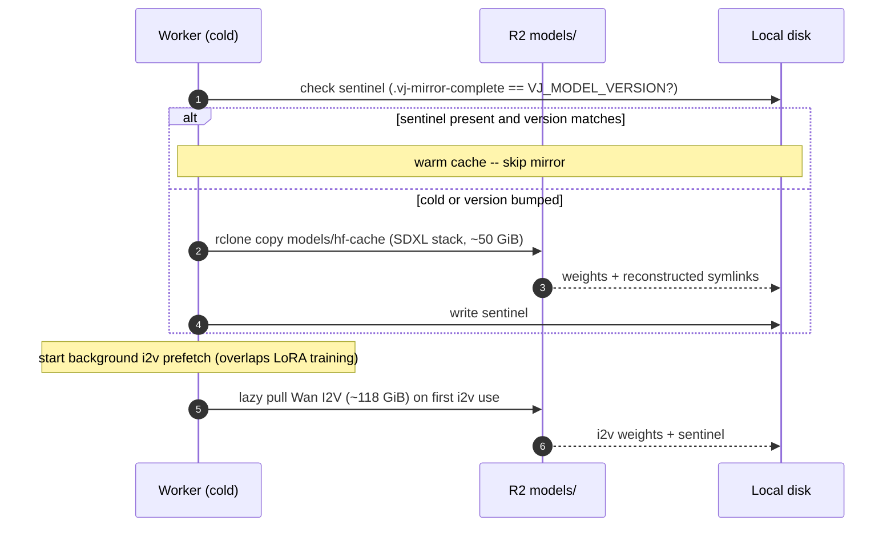

# Operations

How the backend is built, deployed, and run, and the runtime surfaces an operator watches: the
R2 object-key map, the cold-start model mirror, the structured progress channel, and the failure
modes. The build/deploy mechanics also live in [`deploy/README.md`](../deploy/README.md); this
page is the operator's view of the running system.

## The worker image

A GPU runtime: CUDA 12.8 + torch cu128 (Blackwell-safe), the render stack, the `vivijure_backend`
package, AND the curated model weights **baked into the image** (~87 GB bf16 for the datacenter image;
#537). A baked worker carries its own weights, so it is datacenter-agnostic and pays no R2 cold-pull:
it renders from the local cache, gated by the `.vj-baked` marker. The image chain (seed -> runtime ->
backend) and why the weights are baked are in
[weights-base-and-snapshots.md](weights-base-and-snapshots.md) and
[cold-start-design.md](cold-start-design.md).

> **Legacy / non-baked path.** An image WITHOUT the `.vj-baked` marker mirrors the weights from R2 at
> job time (the mirror section below). That path is the fallback, kept for correctness; the shipped
> image is baked and never touches it.

Also baked in, alongside the weights:

- **HuggingFace repo configs** (metadata only, no tensors) for the SDXL / ControlNet /
  IP-Adapter / Wan repos, plus `.no_exist` negative-cache stubs, so diffusers loads offline
  without probing the Hub (`deploy/bake_hf_configs.py`).
- **The RIFE inference package** (~25 KB of pure Python), vendored because Practical-RIFE is
  not on PyPI.
- **System libs**: ffmpeg (Wan video export + off-GPU finish), rclone (the R2 mirror), and the
  OpenCV / glib stack insightface needs.

Entry: `python -m vivijure_backend.worker` -> `worker.main` ->
`runpod.serverless.start({"handler": worker.handler})`. Per job the handler builds a
`GpuPipeline` from the request's typed `RenderConfig`, registers it on the harness seam, and
delegates to `harness.handler` (mirror, R2 in, plan, GPU stages, off-GPU finish, results out).

## Build and deploy

Build and deploy are deliberately separate steps: a build does not touch the live endpoint.

**Build (GitHub Actions, on a git tag).** A pushed `backend-vX.Y.Z` tag triggers
`.github/workflows/release.yml`; a plain commit is a no-op. The image is a chain (#537): a src-only
release is **assemble + push only** (`FROM` the pinned runtime base + `COPY src`, on the
`vivijure-bake-snap` snapshot runner), so it re-pushes ONLY the app layers while the runtime + baked
weight layers dedup on GHCR. The runtime base (CUDA/torch + deps + the baked weights) is built
separately by `runtime-build.yml` from an immutable seed image that stages R2 once per weight version.
An in-image CPU import smoke (`deploy/smoke_imports.py`) catches a missing dep in seconds; on success
the build pushes `ghcr.io/skyphusion-labs/vivijure-backend:X.Y.Z` + `:latest` (the tag drops the
`backend-v` prefix). The full chain, the per-layer GHCR gate, and the re-bake cadence are in
[weights-base-and-snapshots.md](weights-base-and-snapshots.md).

> Release lesson (see [RELEASES.md](../RELEASES.md)): the release step MUST push the tag to origin.
> Tags cut on a local clone and never pushed are lost when the box goes away.

**Deploy to production = the release-gate promote, not a manual pin.** An image reaches the production
serverless endpoint ONLY by passing the automated pod-staging verify: `runpod-verify.yml` spins a GPU
POD on the candidate image, runs the `@event` verify, and on PASS promotes it (repins the endpoint
TEMPLATE, flushes + restores the warm worker pool, smokes a fresh worker). There is no manual
"pin it and see" path to prod; the doctrine and the exact promote sequence are in
[release-gate.md](release-gate.md). (`scripts/pin-runpod-template.py` still exists as a manual tool for
your OWN or a staging endpoint; it is not the production promote path.)

A CPU test gate (`pytest`) runs on every push / PR via GitHub Actions (`tests.yml`), independent of the
tag-triggered release image build (`release.yml`). See [development.md](development.md).

## Environment

Baked into the image (non-secret, already set in the Dockerfile):

| Var | Value | Why |
|---|---|---|
| `HF_HOME` | `/opt/models/hf-cache` | Local HF cache the mirror fills, read offline. |
| `VJ_MODELS_ROOT` | `/opt/models` | Mirror root + completion sentinels. |
| `HF_HUB_OFFLINE` / `TRANSFORMERS_OFFLINE` / `HF_DATASETS_OFFLINE` | `1` | Read weights from the mirror, never the Hub. |
| `PYTHONPATH` | `/opt/vivijure` | `import vivijure_backend`. |
| `PYTORCH_CUDA_ALLOC_CONF` | `expandable_segments:True` | Fragmentation headroom. |

Set on the RunPod endpoint at runtime (the only credential, never baked):

```
R2_ENDPOINT=https://<accountid>.r2.cloudflarestorage.com
R2_ACCESS_KEY_ID=...
R2_SECRET_ACCESS_KEY=...
R2_BUCKET=vivijure
```

The R2 token does double duty: the cold-start model mirror (`r2:<bucket>/models`) and job I/O
(bundle in, render + state out). The worker holds no Cloudflare Access or other secret. See
[configuration.md](configuration.md#environment-variables) for the `VJ_*` tuning vars.

## The cold-start model mirror

> **This is the FALLBACK path (a non-baked image).** The shipped image bakes its weights (see "The
> worker image" above), so a baked worker skips the mirror entirely via the `.vj-baked` marker. The
> mirror below runs only for a legacy / non-baked image; it is kept for correctness.

On a non-baked image a cold worker has no weights; it mirrors them from R2 into the local HF cache,
then renders offline. A warm worker reuses the on-disk cache and skips the mirror.



The cold-start pull fetches only the SDXL stack (~50 GiB). The heavy Wan i2v weights (~118 GiB)
are excluded from the cold pull and mirrored **lazily** on the first `i2v_pipeline()` call, with
their own sentinel; a keyframe-only or preview worker never pays for them. The worker also kicks
off a background i2v prefetch right after the cold pull, so the i2v download overlaps LoRA
training (the network is idle during GPU training). `VJ_MODEL_VERSION` bumps force a re-mirror on
otherwise-warm workers. Mirroring uses rclone with `--links` and reconstructs symlinks from
marker files (rclone stores links as text, not real symlinks).

## R2 object-key map

Every key the worker reads or writes is defined in one place
([`harness/keys.py`](../src/vivijure_backend/harness/keys.py)), so the scheme stays aligned with
the control plane's artifact routes. Project and shot names are slugified to safe path segments.

| Key | Pattern | What |
|---|---|---|
| Bundle (in) | chosen by the control plane, passed as `bundle_key` | The project bundle tar. |
| Final video | `renders/<project>/full.mp4` | The muxed MP4 the control plane polls for. |
| Keyframe | `renders/<project>/keyframes/<shot_id>.png` | A rendered SDXL keyframe. |
| Clip | `renders/<project>/clips/<shot_id>.mp4` | A per-shot i2v clip (offloaded / per-shot finish). |
| LoRA | `loras/<project>/<slot>/pytorch_lora_weights.safetensors` | A trained character adapter. |
| Keyframe hash | `renders/<project>/keyframes/<shot_id>.hash` | Param-hash sidecar driving reuse-vs-regen (#112). |
| Progress log | `renders/<project>/progress/<job_id>.ndjson` | The append-only event stream. |
| Progress snapshot | `renders/<project>/progress/<job_id>.json` | The latest-state snapshot a `/status` route polls. |
| Models (mirror) | `models/hf-cache/...` | The HF weight mirror the cold start pulls. |

Uploaded artifacts carry **no submitter identity**: the studio is single-operator (the identity
strip, vivijure #292), so the control plane sends no `user_email` and `/api/artifact` serves by key
with no per-row ownership check. Artifacts are addressed purely by their R2 key (see the layout above).

## The progress channel

Progress is a structured event channel ([`harness/progress.py`](../src/vivijure_backend/harness/progress.py)),
not stdout scraping. The primary sink is R2 (the worker already holds the token, so this adds no
infra and no secret): an append-style NDJSON event log plus a latest-state JSON snapshot, both
keyed by **project and job id** so concurrent or cancelled runs never clobber each other. A
RunPod `progress_update` hook is supported as an optional secondary sink, and every emit also
prints a human `@event <name> {json}` line.

Everything is best-effort: every R2 write, stdout line, and hook call is wrapped so a logging
failure can never propagate into the render.

Events (discrete stages):

| Event | Fields | When |
|---|---|---|
| `started` | -- | Job begins. |
| `mirror_done` | -- | Cold-start mirror complete. |
| `train_done` | `slot` | A character LoRA finished training. |
| `keyframe_done` | `shot` | A keyframe was generated. |
| `i2v_done` | `shot` | A shot finished animating. |
| `assemble_done` | -- | Clips concatenated (or per-shot manifest written, if offloaded). |
| `upload_done` | `key` | An artifact was uploaded. |
| `complete` | `output_key`, `seconds`, ... | The render finished. |
| `error` | `stage`, `message` | A stage failed (sets snapshot status to `error`). |
| `train_step` | `slot`, `step`, `total`, `loss` | Throttled training progress (the long pole). |
| `i2v_step` | `shot`, `step`, `total` | Per-step i2v progress (~30s/step on final; the live "slow vs hung" signal). |
| `finish_step` | `shot`, `stage`, `done`, `total` | Per-pass finishing progress. |

A few situational markers also appear (e.g. `audio_missing` when a requested `audio_key`
cannot be fetched and the job explicitly opted into `render_overrides.audio_optional` -- without
that opt-in the render FAILS instead -- and `plan_tier`, an informational trace of the card that
actually ran (`actual`) next to the tier(s) the planner targeted for i2v (`planned`); it is NOT a
warning and never gates the render, which always runs on the job's `quality_tier`, not the device
(#163 retired the old `tier_mismatch` warn, which false-fired on the by-design multi-arch pool)).
The snapshot carries `status` (`running` / `complete` / `error`), per-event
`counts`, the `last_event`, and any `error`; `progress.read_snapshot(store, project, job_id)`
reads it back for a status route or a poll script.

## Warm workers and incremental state

After each render the worker uploads what it authored at per-identity keys: each keyframe PNG
with a `.hash` param sidecar, each trained adapter at its `loras/` key. The next render derives
reuse straight from those objects (no shared state tarball; #112 removed
`projects/<project>/state.tar.gz` because concurrent shards raced it last-writer-wins), so a
re-render of one tweaked shot retrains nothing and redraws only that shot (see
[architecture.md](architecture.md#warm-workers-and-incremental-renders)). A warm worker also
keeps every model loaded in `ModelServer`, so a second job pays no model-load cost.

## Failure modes

The harness fails loud where silence would corrupt a render, and stays quiet only where a
failure is genuinely non-fatal.

**Hard failures (the job fails):**
- Bundle missing `storyboard.yaml`, or a tar with a symlink / hardlink / path-traversal entry.
- Validation errors (empty storyboard, blank scene prompt, a `use_characters` slot missing from
  the cast, a slot the plan will train having no reference images).
- A `pretrained_loras` adapter that cannot be staged from R2 (better to fail early than render
  silently without identity).
- A truncated R2 download (`get_file` verifies size against `ContentLength`).
- Bad R2 config or a model-mirror failure on cold start.

**Best-effort (the render continues):**
- Any progress write, stdout line, or RunPod hook call.
- An unfetchable `audio_key` ONLY when the job set `render_overrides.audio_optional: true`
  (emits `audio_missing`, surfaces `audio_missing: true` in the result, ships silent). Without
  the opt-in this is a HARD failure, not best-effort.
- Prior-state restore failure (falls back to a fresh render; safer to redundantly re-render
  than to silently skip work).

## See also

- The build/deploy mechanics in brief: [deploy/README.md](../deploy/README.md).
- What each artifact is and its shape: [contract.md](contract.md).
- The release ledger and lessons: [RELEASES.md](../RELEASES.md).
- The security boundary (one R2 credential, control-plane-trusted input): [SECURITY.md](../SECURITY.md).
