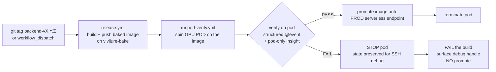

# Release gate: pod = staging, serverless = production

The doctrine that governs how a built image becomes a running production worker, and the CI pipeline
that enforces it. ICD-grade: the contract is reproducible from this doc alone.

## Doctrine

- **A GPU POD is staging / debug.** It is the ONLY place we debug. A pod gives full insight: shell
  in, inspect the baked weights on disk, watch the cu128 kernels load on the real card, read VRAM,
  re-run a shot. The automated verify runs here.
- **The SERVERLESS endpoint is PRODUCTION.** Promoting an image onto the serverless endpoint **is
  shipping to production.** So the serverless endpoint is the production gate, not a debug surface.
- **We never debug on serverless.** It is wasteful (cold workers, no shell, no persistence) and
  gives no insight. Any investigation happens on a pod built from the same image.
- **An image reaches the serverless endpoint ONLY by passing the automated pod-staging verify.**
  There is no manual "pin it and see" path to prod. Build -> pod-verify (staging) -> promote (prod).

## The CI pipeline

Two workflows, one chain:

1. **`.github/workflows/release.yml` -- build + push (no GPU).** On a `backend-vX.Y.Z` tag (or a
   manual `workflow_dispatch`), on the `vivijure-bake` larger runner: stage the curated weight seed
   from R2, reconstruct HF-cache symlinks, bin-pack into <10 GB layers, build the baked image,
   run the per-layer GHCR gate + a CPU import smoke, and push `:X.Y.Z` + `:latest` to GHCR. This
   step never touches a GPU and never ships to prod.
2. **`.github/workflows/runpod-verify.yml` -- the staging gate (GPU pod).** Spins a GPU **pod** on
   the pushed image, runs the verify harness (`deploy/runpod_verify.py`: structured `@event`
   assertions + pod-only insight checks), then:
   - **PASS:** promote the image onto the production serverless endpoint, then **terminate** the pod.
   - **FAIL:** **stop** the pod (state preserved for SSH debug), surface the pod/debug handle, **fail
     the build, do not promote.**

The verify control job itself runs on a stock `ubuntu-latest` runner -- it only drives the RunPod
API; the GPU is the pod, not the runner.

## Spend gating (how GPU $ is controlled)

- **The trigger IS the spend gate.** `runpod-verify.yml` fires GPU only on a deliberate
  `workflow_dispatch` or after a release-tag build -- **never on a PR or an ordinary push.** Creating
  a `backend-v*` tag / dispatching the workflow is the explicit "go." There is no path where a fork
  PR or a routine commit spins a GPU.
- **Defence in depth on the pod.** The harness creates the pod with a **hard TTL (auto-stop)** and a
  **cost ceiling**, and the workflow tears it down on both the PASS (terminate) and FAIL (stop) paths
  plus an always-run backstop. A forgotten debug pod cannot bleed GPU: its TTL stops it regardless.
- **Tier-aware GPU.** H200/B200 for the datacenter bf16 image (the only image that runs full Wan); a
  cheap consumer GPU for the homelab-lite images.

## Image matrix (build lanes)

Three images, quality-differentiated. Motion (Wan i2v) quality is always the datacenter ceiling;
home VRAM buys better stills, training, and finish, never local full-Wan motion.

| Image | Target card | Bakes | Runs | Build runner | Motion |
|---|---|---|---|---|---|
| **DATACENTER** (bf16 Wan 2.2) | H200 / B200 (>=141 GB) | full curated set incl. **bf16 Wan** | hosted serverless = **production**; full-step i2v at full fidelity | `vivijure-bake` (1200 GB) | local, full Wan |
| **HOMELAB T1** | 12 GB VRAM (3060 / 4070 class) | **small set only**: SDXL fp16 keyframes + finish models, **NO Wan** | local SDXL keyframes + light finish | stock hosted runner | cloud-passthrough / hosted datacenter endpoint |
| **HOMELAB T2** | 24 GB VRAM (3090 / 4090 class) | **small set only** (same, no Wan) | higher-res keyframes + refiner pass, comfortable LoRA training, higher-factor local upscale/finish | stock hosted runner | cloud-passthrough / hosted datacenter endpoint |

Build facts:

- **Only the datacenter bf16 image needs the big `vivijure-bake` runner** (~117 GB baked, ~370 GB
  peak build disk). The homelab images bake the SMALL set (SDXL fp16 + finish models, no Wan: a
  sub-141 GB card cannot run Wan, so shipping it would be dead weight) and **build fine on stock
  runners.**
- **All three are self-contained / baked.** Homelabbers have no R2-near-GPU, so the homelab images
  carry their weights with no mirror dependency -- same `.vj-baked` short-circuit as the datacenter
  image, just a smaller set.
- **The capability ladder is quality-differentiated, not feature-gated.** More home VRAM buys better
  stills (higher-res keyframes, refiner), better character fidelity (LoRA training), and stronger
  local finish/upscale. Motion always routes to the datacenter ceiling.

> **Sequencing:** the homelab images (Lane C) are built AFTER the datacenter bake validates on the
> pod-staging gate. This section is the locked build spec; no homelab build action is taken until
> the datacenter image passes verify.

## See also

- [cold-start-design.md](cold-start-design.md) -- why the bake replaced the network-volume plan, and
  the disk-budget math that sized the `vivijure-bake` runner.
- [operations.md](operations.md) -- the operator's view of the running system.
- `deploy/Dockerfile`, `deploy/bake_layers.py`, `.github/workflows/release.yml`,
  `.github/workflows/runpod-verify.yml` -- the implementation.
