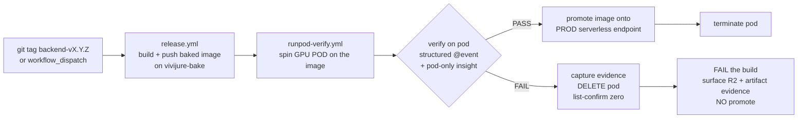

# Release gate: pod = staging, serverless = production

> **STATUS (2026-07-02, truth-pass S7): the LIVE gate is WIRED (dispatch-gated).** Both prerequisites
> landed -- RUNPOD_API_KEY + R2_* are CI secrets, and the pod-side @event emitter exists
> (`vivijure_backend.verify`, #175). `.github/workflows/runpod-verify.yml` now carries a `live-gate` job
> that (on an explicit `live=true` workflow_dispatch) spins ONE SECURE GPU pod on the candidate image,
> drives the @event verify over the run-scoped R2 `summary.json` channel, and tears the pod down
> (DELETE on every path -- PASS and FAIL both end at delete + list-confirm zero; a FAIL captures its
> evidence to the R2 channel + a workflow artifact first) with an always-run reap backstop. PROMOTE
> (repin prod `t9wcvlxh8rc5la`) is OFF by default -- a proof run validates up|verify|down without
> touching prod; a real release turns it on. Per verify-before-require the job goes REQUIRED in branch
> protection only AFTER a real dispatch passes green end to end; until then an image may still reach
> prod by a deliberate manual `:version` pin.

The doctrine that governs how a built image becomes a running production worker, and the CI pipeline
intended to enforce it. ICD-grade: the contract is reproducible from this doc alone.

## Doctrine

- **A GPU POD is staging / debug.** It is the ONLY place we debug. A pod gives full insight: shell
  in, inspect the baked weights on disk, watch the cu128 kernels load on the real card, read VRAM,
  re-run a shot. The automated verify runs here.
- **The SERVERLESS endpoint is PRODUCTION.** Promoting an image onto the serverless endpoint **is
  shipping to production.** So the serverless endpoint is the production gate, not a debug surface.
- **We never debug on serverless.** It is wasteful (cold workers, no shell, no persistence) and
  gives no insight. Any investigation happens on a pod built from the same image.
- **An image reaches the serverless endpoint ONLY by passing the automated pod-staging verify.**
  There is no manual "pin it and see" path to prod. Build -> pod-verify (staging) -> promote (prod).



## The CI pipeline

Two workflows, one chain:

1. **`.github/workflows/release.yml` -- build + push (no GPU).** On a `backend-vX.Y.Z` tag (or a
   manual `workflow_dispatch`), on the `vivijure-bake` larger runner: stage the curated weight seed
   from R2, reconstruct HF-cache symlinks, bin-pack into <10 GB layers, build the baked image,
   run the per-layer GHCR gate + a CPU import smoke, and push `:X.Y.Z` + `:latest` to GHCR. This
   step never touches a GPU and never ships to prod.
2. **`.github/workflows/runpod-verify.yml` -- the staging gate (GPU pod).** Spins a GPU **pod** on
   the pushed image, runs the verify harness (`deploy/runpod_verify.py`: structured `@event`
   assertions + pod-only insight checks), then:
   - **PASS:** promote the image onto the production serverless endpoint, then **terminate** the pod.
   - **FAIL:** capture evidence FIRST (the R2 `summary.json` + `events.ndjson` outlive the pod; the
     pod-log tail is pulled into a workflow artifact), then **DELETE** the pod and **list-confirm
     zero**, **fail the build, do not promote.** A stopped pod still bills disk and leaves a pad
     standing, so it is never a CI exit state -- stop is only a mid-debug state while a human is
     actively attached in-session.

The verify control job itself runs on a stock `ubuntu-latest` runner -- it only drives the RunPod
API; the GPU is the pod, not the runner.

## The pod verify channel (the `@event` contract)

The pod runs `python -m vivijure_backend.verify` (module `src/vivijure_backend/verify.py`) as its
verify entrypoint. The harness LAUNCHES it: it spins the pod with the verify command as the RunPod
container start command (`docker_args`, wrapped in the image conda env), NOT the image default CMD
(the serverless worker, which emits no @event contract). **The image under test must therefore
contain the verify module** -- i.e. it is built from code that carries `vivijure_backend.verify`
(post the emitter landing); an older baked image predating it cannot be gated, since the entrypoint
would not exist. It is the **writer**; the harness (`deploy/runpod_verify.py`) is the **reader**.
The module is the single source of the wire contract they share; this section reproduces it so the
gate is auditable from the docs alone (ICD standard).

**Armed only by `VJ_VERIFY`.** `main()` is a hard no-op (prints one `@event verify_skipped` line,
exits 0) unless `VJ_VERIFY` is truthy, so the emitter has **zero effect on a normal render**. The
harness sets the pod env when it spins the staging pod.

**No silent failure.** Every fatal precondition (missing `VJ_VERIFY_RUN_ID`, or an incomplete/misnamed R2 config -- the F17 class, creds passed as `R2_S3_*`/`AWS_*` instead of the `R2_*` names the store reads) emits a structured terminal `@event verify_fatal {stage, missing}` to stdout BEFORE exiting non-zero (the `missing` list names the absent env vars, so the harness diagnoses it without prose-parsing). A launch-side env mistake can never present as a 30-minute empty prefix with nothing to read.

**Channel = R2, run-scoped (option B, same as the render progress channel).** The worker already
holds the R2 token, so this adds no infra and no secret, and the channel is durable/queryable after
the pod is torn down. Two objects per run, keyed by run id under a dedicated `verify/` prefix so a
probe never collides with a project render (`renders/...`):

- `verify/<run_id>/summary.json`  (`application/json`) -- **the poll target.** Latest state:

  ```json
  {"schema": "vivijure-verify/1", "run_id": "<run_id>",
   "status": "running" | "complete" | "error",
   "started_ts": 0.0, "updated_ts": 0.0, "last_event": "complete",
   "error": null,
   "events": [{"seq": 0, "ts": 0.0, "event": "gpu_probe", "payload": {}}]}
  ```

- `verify/<run_id>/events.ndjson`  (`application/x-ndjson`) -- the same records, one JSON object per
  line (a human/tail stream; the summary is the machine poll target).

Both objects are **rewritten in full on every emit** (a verify run is a handful of events, one
writer, one process -- so the emitter accumulates in memory and re-PUTs the tiny object; no S3
append, no second writer to race). Last-writer-wins per event name matches `find_event`.

**Redundant transport.** Every event is also printed to stdout as `@event <name> {json-payload}`,
byte-identical to the wire `parse_events` reads, so the pod logs stay a fallback if R2 is briefly
unreachable. R2 writes are best-effort (a channel hiccup must never abort the render before it can
emit `error`); the stdout mirror is unconditional.

**The events** (payloads are exactly the fields `evaluate()` reads -- one contract, no translation):

| event | payload | meaning |
|---|---|---|
| `gpu_probe` | `torch_cuda, kernel_ok, vj_baked, weights_on_disk, vram_free_gb, vram_total_gb, device_name` | pod-only insight: torch sees the GPU, the cu128 kernel LOADS on this card, the baked sentinel + weights are on disk, VRAM headroom |
| `first_frame` | `seconds` | time-to-first-frame (measured from the render's own progress channel) |
| `sharpness` | `value, baseline` | the #118 method-ii quality gate: variance-of-Laplacian of the rendered first frame vs the runtime-quant baseline (`VJ_SHARPNESS_BASELINE`) |
| `complete` | `output_key, clip_bytes` | render done, output object written |
| `error` | `stage, message` | a probe/render failure; also flips `summary.status` to `error` |

**Harness integration (no prose parsing).** The live path polls `summary.json` until `status` is
terminal, then feeds `verify.events_from_summary(raw)` -> `list[(name, payload)]` straight into the
existing `evaluate(events, cfg)`. Nothing scrapes English text.

**Pod env the harness sets:**

| var | meaning |
|---|---|
| `VJ_VERIFY` | arm the channel (`1`/`true`/`yes`/`on`) |
| `VJ_VERIFY_RUN_ID` | the run id (the harness assigns it, so it knows the key to poll -- required when armed) |
| `VJ_VERIFY_KEY_PREFIX` | key prefix, default `verify` |
| `VJ_VERIFY_BUNDLE_KEY` | the draft project bundle the harness staged in R2 for the verify render |
| `VJ_VERIFY_PROJECT` | project name for the job/keys, default `verify` |
| `VJ_SHARPNESS_BASELINE` | the sharpness reference the ratio gate compares against |

The emitter, the pure probe/metric helpers, and the `run_verify` orchestration are unit-tested on CPU
(`tests/test_verify.py`) with a fake store and a fake render -- including a cross-module test that a
`run_verify` channel read back through `events_from_summary` passes `runpod_verify.evaluate`. The GPU
draft render (`_pod_draft_render`) is a deferred, pod-only seam whose live proof is the authorized
pod run, exactly like the harness's own `RunpodMcpPodClient` seam.

## Spend gating (how GPU $ is controlled)

- **The trigger IS the spend gate.** `runpod-verify.yml` fires GPU only on a deliberate
  `workflow_dispatch` or after a release-tag build -- **never on a PR or an ordinary push.** Creating
  a `backend-v*` tag / dispatching the workflow is the explicit "go." There is no path where a fork
  PR or a routine commit spins a GPU.
- **Defence in depth on the pod.** The harness creates the pod with a **hard TTL (auto-stop)** and a
  **cost ceiling**, and the workflow tears it down on BOTH the PASS and FAIL paths (delete + list-confirm zero on
  each; a FAIL captures its evidence first) plus an always-run reap backstop. A forgotten pod cannot
  bleed GPU: its TTL stops it and the backstop deletes it regardless.
- **Tier-aware GPU.** H200/B200 for the datacenter bf16 image (the only image that runs full Wan); a
  cheap consumer GPU for the homelab-lite images.

## Image matrix (build lanes)

Three images, quality-differentiated. Motion (Wan i2v) quality is always the datacenter ceiling;
home VRAM buys better stills, training, and finish, never local full-Wan motion.

| Image | Target card | Bakes | Runs | Build runner | Motion |
|---|---|---|---|---|---|
| **DATACENTER** (bf16 Wan 2.2) | H200 / B200 (>=141 GB) | full curated set incl. **bf16 Wan** (the experts ship FP32; a free CPU **fp32->bf16 re-cast** halves them at zero quality cost) | hosted serverless = **production**; full-step i2v at full fidelity | `vivijure-bake` (1200 GB) | local, full Wan |
| **HOMELAB T1** | 12 GB VRAM (3060 / 4070 class) | **small set only**: SDXL fp16 keyframes + finish models, **NO Wan** | local SDXL keyframes + light finish | stock hosted runner | cloud-passthrough / hosted datacenter endpoint |
| **HOMELAB T2** | 24 GB VRAM (3090 / 4090 class) | **small set only** (same, no Wan) | higher-res keyframes + refiner pass, comfortable LoRA training, higher-factor local upscale/finish | stock hosted runner | cloud-passthrough / hosted datacenter endpoint |

Build facts:

- **Only the datacenter bf16 image needs the big `vivijure-bake` runner** (~87 GB baked after the
  fp32->bf16 re-cast, ~280 GB peak build disk; baking the RAW fp32 experts would be ~140 GB /
  ~440 GB transient, which is why we re-cast). The homelab images bake the SMALL set (SDXL fp16 +
  finish models, no Wan: a sub-141 GB card cannot run Wan, so shipping it would be dead weight) and
  **build fine on stock runners.**
- **All three are self-contained / baked.** Homelabbers have no R2-near-GPU, so the homelab images
  carry their weights with no mirror dependency -- same `.vj-baked` short-circuit as the datacenter
  image, just a smaller set.
- **The capability ladder is quality-differentiated, not feature-gated.** More home VRAM buys better
  stills (higher-res keyframes, refiner), better character fidelity (LoRA training), and stronger
  local finish/upscale. Motion always routes to the datacenter ceiling.

> **Sequencing:** the homelab images (Lane C) are built AFTER the datacenter bake validates on the
> pod-staging gate. This section is the locked build spec; no homelab build action is taken until
> the datacenter image passes verify.

## Sovereignty: R2-ours (prod-only) vs self-contained (public)

This is the crux of why the FULL bf16 bake matters, not just the fp8 one.

**Prod state (re-baselined 2026-06-29):** the production serverless endpoint (`t9wcvlxh8rc5la`) runs
image **0.2.28 (fp8-baked PARTIAL)** with **no network volume** (`networkVolumeId ""`) and the
template env carries **no `VJ_VOLUME_ROOT` / `VJ_VOLUME_SELF_PRELOAD`** -- volumes are already OFF in
prod, so there is nothing to detach; the bake is purely additive to the live config.

**The runtime weight sources, confirmed from code:**
- A baked worker reads weights from the image (`HF_HUB_OFFLINE=1` is baked into the Dockerfile ENV, so
  `from_pretrained` NEVER reaches the HF Hub -- the only source is the local cache).
- The fp8-PARTIAL image bakes the draft/standard path but the **final tier still lazy-pulls bf16 from
  `r2:vivijure/models/hf-cache/hub/...`** (`harness/models_mirror.ensure_i2v_models`). That is **OUR
  R2** (the `vivijure` bucket via our `R2_*` creds), not HF-public.
- `HF_TOKEN` in the template env is **build-time only**: `deploy/bake_hf_configs.py` flips the offline
  flags to 0 to fetch repo CONFIGS at build. At runtime (offline=1) `HF_TOKEN` is inert. So it is NOT
  a runtime weight source; our R2 creds are.

**Consequence:** the fp8-partial image's final tier depends on OUR R2 creds, so it is **prod-only** --
a BYO-RunPod renter who deploys the public image with their own keys has no access to our R2 bucket
and cannot load the final tier. **The FULL bf16 bake is what makes the public datacenter image
self-contained:** the final tier loads from BAKED full-precision weights, killing the R2 lazy-pull
entirely (the #118 "B-seam" bf16-lazy-on-final becomes obsolete). No R2 dependency, no creds, no
egress -- the renter runs it standalone. That is the public-release / sovereignty win the bake exists
for; the fp8 image is the prod-only stepping stone.

(Serve-side disk is a non-issue: the RunPod worker container disk is 500 GB, so a ~87 GB full-bf16
image fits with room to spare. The only disk constraint is the BUILD runner -- see the disk budget.)

## See also

- [cold-start-design.md](cold-start-design.md) -- why the bake replaced the network-volume plan, and
  the disk-budget math that sized the `vivijure-bake` runner.
- [operations.md](operations.md) -- the operator's view of the running system.
- `deploy/Dockerfile`, `deploy/bake_layers.py`, `.github/workflows/release.yml`,
  `.github/workflows/runpod-verify.yml` -- the implementation.
