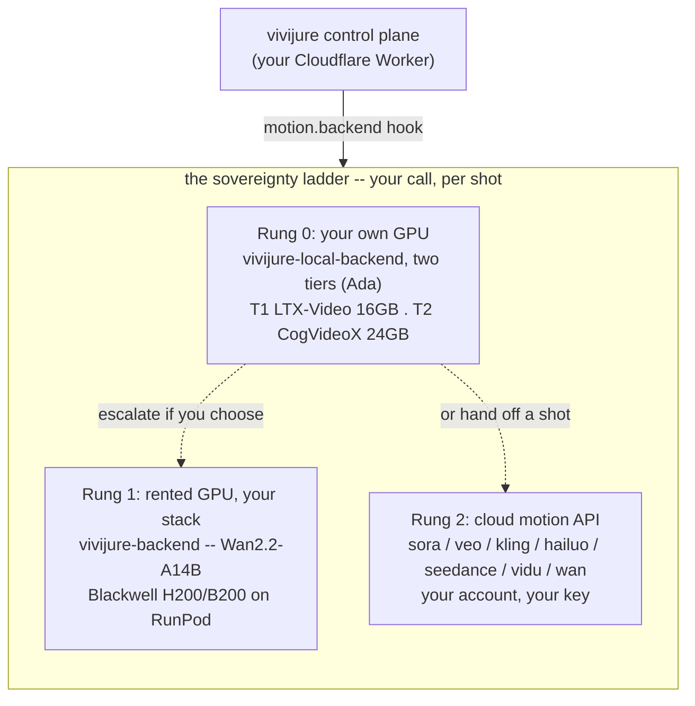

# Render backends: the sovereignty ladder

Vivijure is built so you own your work and choose your hardware. The studio (the `vivijure`
control plane) is a thin module host; the thing that actually turns a storyboard into video is a
**render backend** plugged in behind a typed `motion.backend` hook. There is not one backend, there
is a **ladder**, and you decide which rung to stand on.

This doc is the canonical map of those rungs: which engine runs where, on what class of GPU, at what
tiers, and how they all speak the same contract so the control plane does not care which one you
picked. It is reproducible from this page alone.

## The principle

**Self-host first. Escalate only if you choose to, and only as far as you choose.**

- **Rung 0 -- your own GPU.** Run the whole pipeline on your own Ada-class card via
  `vivijure-local-backend`. Two engines live on this rung: **LTX-Video** (the light, fast default
  that fits the 16 GB floor) and **CogVideoX** (the higher-fidelity option when your card has the
  headroom). No subscription, no account wall, no metering. You bring the GPU and the keys; the
  studio brings the pipeline. This is the default the project is built around.
- **Rung 1 -- rent a bigger GPU, still your stack.** Point the `own-gpu` module at a RunPod
  serverless endpoint running `vivijure-backend` (the datacenter Wan2.2 engine). Same code, same
  contract, your RunPod account and keys. You rent seconds of a B200, you do not rent a SaaS.
- **Rung 2 -- call a cloud motion API.** If you would rather hand a shot to a hosted model, the
  control plane carries opt-in modules for the major cloud i2v services (`openai-sora`,
  `google-veo`, `kling`, `minimax-hailuo`, `seedance`, `vidu-q3`, the Alibaba Wan APIs). Your
  account, your key, per the provider's terms.

It is your call, per shot, with no lock-in at any rung. **skyphusion hosts nothing and sees nothing**
of your projects or your keys -- the studio runs on your Cloudflare account and talks to whatever
backend you attach.

## The backend matrix

| | Rung 0 -- local | Rung 1 -- datacenter | Rung 2 -- cloud API |
|---|---|---|---|
| **Repo** | `vivijure-local-backend` | `vivijure-backend` | control-plane modules (in `vivijure`) |
| **Engine** | LTX-Video + CogVideoX (two tiers, below) | Wan2.2-A14B (two-expert MoE) | provider model (Sora, Veo, Kling, ...) |
| **GPU class** | Ada (consumer) | Blackwell (datacenter) | provider-hosted |
| **CUDA arch** | sm_89 / cu124 | sm_120 / cu128 | n/a |
| **VRAM target** | 16 GB (LTX) / 24 GB-class (CogVideoX) | H200 / B200 (141 GB+) | n/a |
| **Where it runs** | your box, via tunnel | RunPod serverless (yours) | provider cloud |
| **License posture** | LTX Open Weights (< $10M); CogVideoX (2B Apache, 5B register) | Apache/community model weights | provider terms |
| **Escalation** | rent (Rung 1) or call (Rung 2) | the quality ceiling | swap provider/model |

The datacenter Wan2.2 engine is the **quality ceiling** and never runs at home: it is a ~28B
two-expert MoE that needs H200+ (even an H100-80GB OOMs). A serious homelabber who wants more than
the local rung delivers escalates to Rung 1 (rent it) or Rung 2 (call it), not to "run Wan on my 4060."

### Rung 0: the two homelabber target tiers

Self-host is itself a two-tier ladder, so a homelabber picks the rung their card fits:

| Local tier | Engine | GPU target | Character |
|---|---|---|---|
| **Tier 1 -- entry** | LTX-Video | Ada, RTX 4060 Ti **16 GB** floor | lightest real i2v, few-step distilled, sub-minute class; the fast default |
| **Tier 2 -- higher** | CogVideoX | Ada, **24 GB-class** headroom | higher fidelity (strong first-frame identity + coherent motion + text control), slower |

Tier 1 (LTX) is the validated floor (peak ~10.4 GB on a 16 GB card). Tier 2 (CogVideoX) is the
higher-quality local option for cards with the headroom; it can run tighter but trades a lot of speed
(community reports ~15 min/clip on a 12-16 GB card), so 24 GB-class is the comfortable target. Both
are self-host on your own Ada silicon -- Tier 2 is "more fidelity on a bigger card," not "leave your
box." The exact ceilings per tier are benchmark-finalized on real silicon, same as the LTX numbers below.

## Quality tiers (the same three names, honest per rung)

The control plane owns one tier vocabulary -- `draft` / `standard` / `final` -- and injects the
chosen tier into whatever `motion.backend` module is wired. Each backend maps those same three names
onto what its hardware can honestly deliver. `final` on a 16 GB card is **that card's honest
ceiling, not datacenter parity**. (The control plane silently drops a tier value a module does not
declare, so every backend keeps the same enum; the honesty is in the mapping, not in renaming.)

**Rung 1 -- datacenter (`vivijure-backend`, Wan2.2):**

| Tier | Keyframe | Image-to-video | Finish | i2v GPU |
|---|---|---|---|---|
| `draft` | Hyper-SD 4-step | Lightning 4-step distill | none (preview) | RTX PRO 6000 |
| `standard` | Hyper-SD 8-step | full 20-step + EasyCache | interpolate 2x | H200 |
| `final` | full 30-step | full 40-step + MixCache | interpolate 2x + face restore | B200 |

**Rung 0, Tier 1 -- local LTX (`vivijure-local-backend`, validated on a 16 GB Ada card, peak ~10.4 GB):**

| Tier | Model | Steps | Resolution | Max frames | Intent |
|---|---|---|---|---|---|
| `draft` | LTX-Video (base) | 25 | 512x320 | 97 | fast preview |
| `standard` | LTX-Video (base) | 40 | 704x512 | 121 (~5s @ 24fps) | the comfortable middle |
| `final` | LTX-Video (base) | 50 | 768x512 | 121 | the card's honest ceiling |

Tier 2 (CogVideoX) maps the same three tier names at higher fidelity on a 24 GB-class card; its
per-tier ceilings are benchmark-pending. (Full local rationale -- why LTX is the entry tier and
CogVideoX the higher one, over SVD / AnimateDiff -- is in
`vivijure-local-backend/docs/i2v-model-selection.md`.)

## One contract, either door

Every rung answers the **same `i2v_clip` action**, so the control plane drives them identically:

- **Request:** `{ project, shot_id, prompt, keyframe_key?, config }` (where `config` carries the
  per-engine knobs; `quality` is the tier).
- **Result (pointer-only):** `{ clip_key, shot_id, num_frames, fps, seconds, distilled }`.
- **Shared R2 layout:** the keyframe at `renders/<project>/keyframes/<shot>.png`, the clip at
  `renders/<project>/clips/<shot>_i2v.mp4`, so the control plane's R2-presence completion check
  treats either backend's output identically.

`vivijure-local-backend`'s contract is a deliberate, documented parallel copy of `vivijure-backend`'s
i2v_clip shape -- that sameness is the whole point. (A conformance guard keeping the two copies from
silently diverging is tracked as follow-up.)

## Deployed state (verified 2026-06-29)

Recorded here so the docs match reality, not records: the live `vivijure-backend` prod endpoint runs
a **config-only** image (`:0.2.28`) -- the CUDA + torch + deps runtime with **no model weights baked
in**; cold workers mirror the weight set from R2 (bucket `vivijure`) at startup, with network volumes
detached. The **single baked image** (weights in the layer, zero cold-pull) is in flight, not yet
shipped: the fp8 load path and bake-sentinel (PR #118), the bake pipeline + `vivijure-bake` build
runner + pod-staging verify gate (PR #127), and the bf16 full-bake follow-on. When that lands, a cold
worker carries its own weights and is datacenter-agnostic. Until then, the R2 mirror is the live cold
path. See `docs/cold-start-design.md` for the cold-start cost model and the bake decision.
